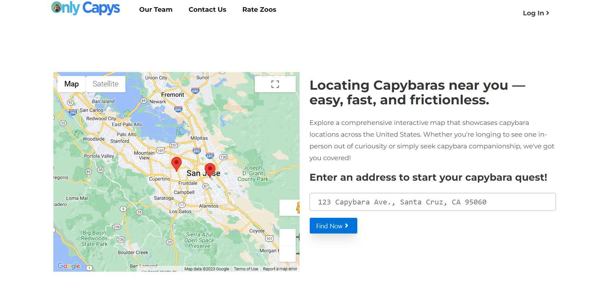
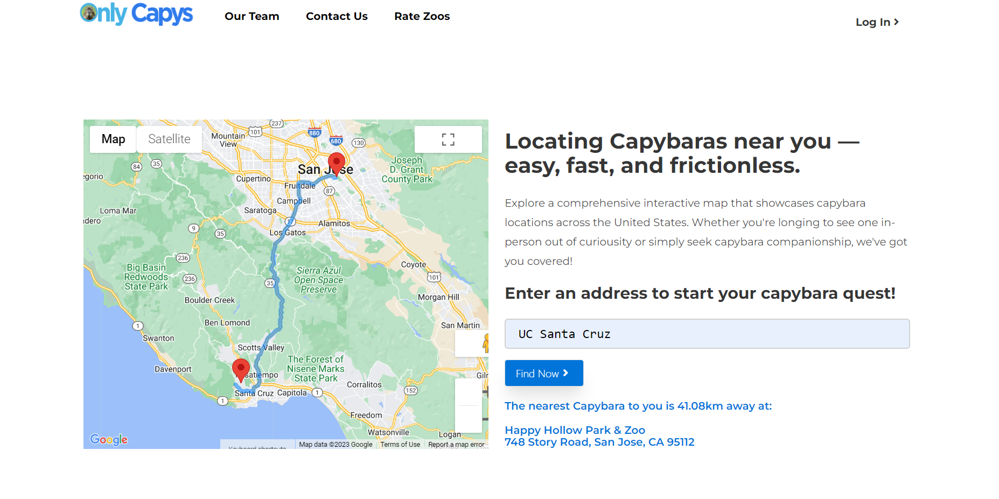
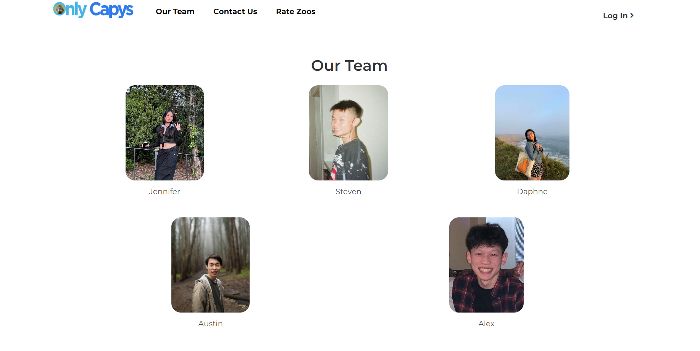
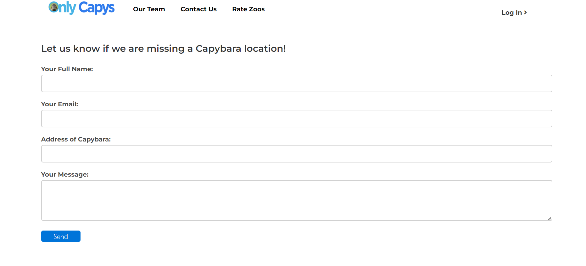
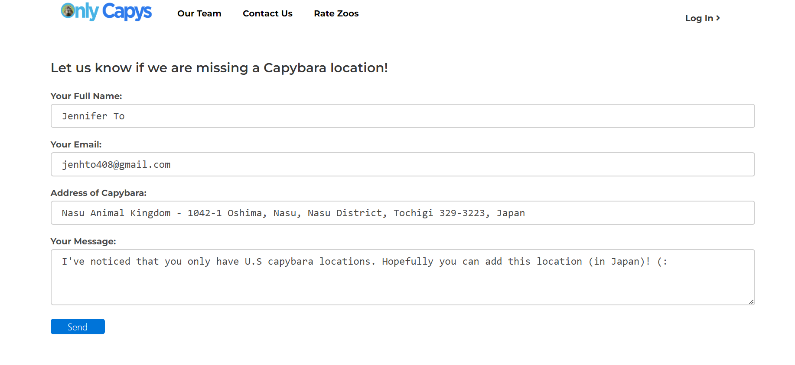
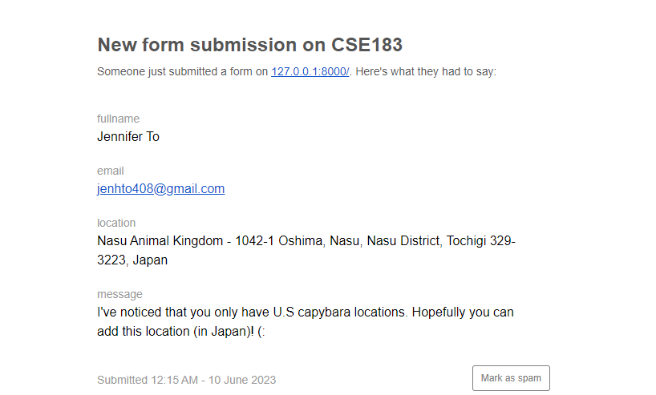

<details>
  <summary>Table of Contents</summary>
  <ol>
    <li><a href="#onlycapys">OnlyCapys</a></li>
    <li><a href="#built-with">Built With</a></li>
    <!--
    <li>
      <a href="#getting-started">Getting Started</a>
      <ul>
        <li><a href="#prerequisites">Prerequisites</a></li>
        <li><a href="#installation">Installation</a></li>
      </ul>
    </li>-->
    <li><a href="#usage-and-user-stories">Usage and User Stories</a></li>
    <li><a href="#main-pages">Main Pages</a></li>
    <li><a href="#implementation-plan">Implementation Plan</a></li>
    <li><a href="#contributors">Contributors</a></li>
  </ol>
</details>

## What is OnlyCapys?
OnlyCapys is a web application that helps users find capybaras near them! Users enter in an address, location, or zip code, and our web application will generate a map of their area, and the location of the closest known capybara location to them. We gather information from a variety of sources, including zoos and verified user submissions, in order to make up our database of known capybara locations.
<br><br>
Our web application also includes CapyFact and Rate Zoos. CapyFact provides users with randomly generated capybara images and facts. We hope for it to educate users about these fascinating creatures and their habits. Rate Zoos allow users to 'like' zoos to recommend which zoos are worth a visit to other users.
<br><br>
If we are missing any zoos, feel free fill out our Contact Us form, and we will update our database with them.

## Built With
<span>
<!-- py4web -->
<a href="https://py4web.com/" target="_blank" rel="noreferrer">  </a>
<!-- vue.js -->
 <a href="https://vuejs.org/" target="_blank" rel="noreferrer">  </a>
<!-- bulma -->
<a href="https://bulma.io/" target="_blank" rel="noreferrer">  </a>
</span>

<!--
## Getting Started

This is an example of how you may give instructions on setting up your project locally.
To get a local copy up and running follow these simple example steps.

### Prerequisites

This is an example of how to list things you need to use the software and how to install them.
* npm
  ```sh
  npm install npm@latest -g
  ```

### Installation

_Below is an example of how you can instruct your audience on installing and setting up your app. This template doesn't rely on any external dependencies or services._

1. Get a free API Key at [https://example.com](https://example.com)
2. Clone the repo
   ```sh
   git clone https://github.com/your_username_/Project-Name.git
   ```
3. Install NPM packages
   ```sh
   npm install
   ```
4. Enter your API in `config.js`
   ```js
   const API_KEY = 'ENTER YOUR API';
   ```
-->

## Main Pages
### Figma
https://www.figma.com/file/xhpThAoGEcpxTyCfcZVV1n/CSE183---Capybara-Project-Proposal?node-id=0%3A88&t=GRIpDimNPT0jz7Yj-1

### Index
Before Search

After Search


### Our Team


### Contact Us
Before Form Submit

After Form Submit

Email Received By (onlycapys@gmail.com)


### Rate Zoos
Insert Rate Zoos img here

## Data Organization
https://lucid.app/lucidspark/de716b28-e608-43b0-9915-e16e36c45890/edit?viewport_loc=-567%2C-115%2C3454%2C1686%2C0_0&invitationId=inv_9582b85a-96f6-465f-a9b2-6f4143787be6

## Usage and User Stories
Welcome to OnlyCapys, the premier website for capybara sightings in your area! 

Our website is designed to help you find capybaras near you. To begin, simply enter your location or zip code into the search bar on our homepage. Our system will then generate a map of your area, highlighting any known capybara sightings nearby. In addition to our mapping system, OnlyCapys also provides a wealth of information about capybaras. Our website features articles, videos, and photos that will help you learn more about these fascinating creatures and their habits. We also may have a forum where you can connect with other capybara enthusiasts and share your own sightings and experiences though you will have to sign up for an account to post! In addition, we have been in the works of implementing a random capybara meme generator, and a capybara matchmaker to brighten up your day. You may wonder how we gather data on capybara sightings! We gather information from a variety of sources, including social media platforms, wildlife organizations, and verified user submissions. Through this, we can create a comprehensive map of capybara sightings in your area that is always up-to-date and accurate.

Overall, OnlyCapys is the perfect website for anyone who loves capybaras and wants to learn more about these amazing creatures. Whether you are a wildlife enthusiast, photographer, or simply curious about capybaras, our website has everything you need to find and track these gentle giants in your area.

## Implementation Plan
Page Layout/Design/Styling:
- Daphne
- Jen

API/Other Coding:
- Austin
- Steven
- Alex
- Jen

Schedule:
- Stage 1 (Week 5-6): Web page (all pages) setup
- Stage 2 (Week 7-8): At least: Location implemented; At Most: Location, Animal API
- Stage 3 (Week 9-10): Polish (styling and reactive elements); If free time: Forum, Matchmaker, Meme Generator pages 

## Contributors
<a href="https://github.com/jenhuynhto">Jennifer To</a>
<br>
<a href="https://github.com/stevebuibui">Steven Bui</a>
<br>
<a href="https://github.com/austinyen56">Austin Yen</a>
<br>
<a href="https://github.com/blu-octopus">Daphne Cheng</a>
<br>
<a href="https://github.com/anguy243">Alex Nguyen</a>
